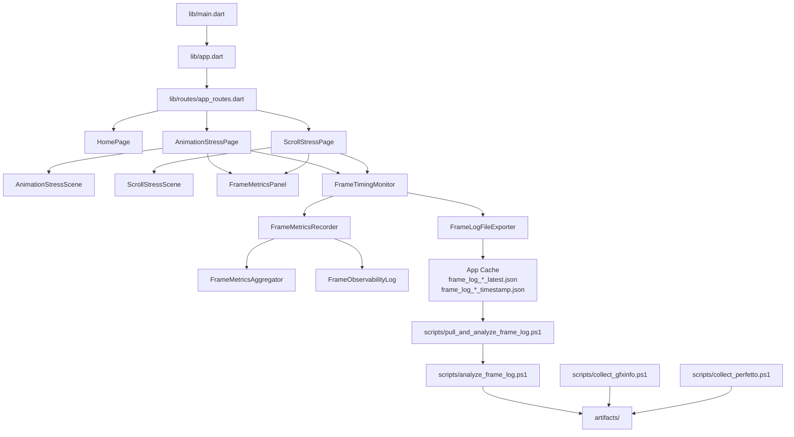
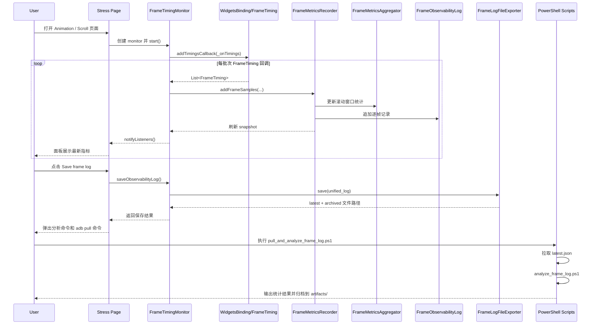
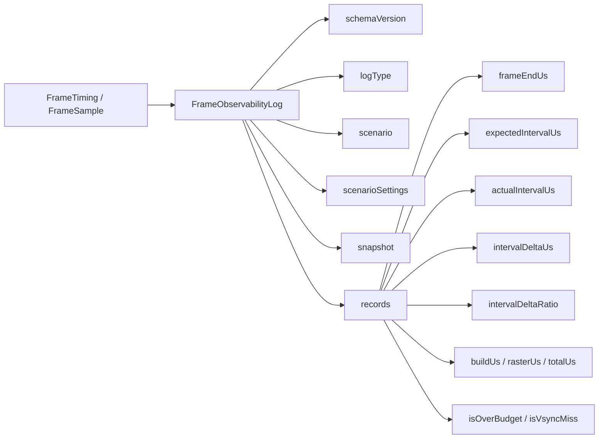
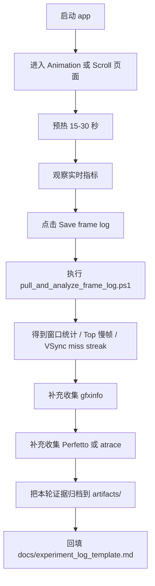

# VSync Lab 项目理解速览

这份文档的目标不是替代源码，而是给你一个足够清晰的心智模型。读完后，你应该能回答 4 个问题：

1. 这个仓库到底在做什么。
2. 页面层、监控层、日志层分别负责什么。
3. 一次实验从启动到产出分析结果会经过哪些环节。
4. 面板上的核心指标大致是怎么算出来的。

## 1. 一句话定位

`vsync_lab` 是一个 **Android-only 的 Flutter 性能实验仓库**。

它不追求业务功能，而是专门用来：

- 复现老设备上的 VSync 不稳定、掉帧和帧率抖动问题
- 通过 `FrameTiming`、`gfxinfo`、Perfetto/atrace 建立可观测性
- 把采样、聚合、导出逻辑沉淀成一个可复用的小工具包

如果只记一句话，可以记这个：

> 这是一个“Flutter 帧调度问题实验平台”，而不是普通业务 App。

## 2. 仓库分层

### 2.1 `lib/` 是实验 App 壳层

这里主要负责“给你一个能稳定复现问题的场景”和“把指标显示出来”。

- `lib/features/home/`
  - 首页和实验入口
- `lib/features/stress/`
  - 两个压测场景：动画压测、滚动压测
- `lib/widgets/frame_metrics_panel.dart`
  - 实时展示监控结果
- `lib/routes/`
  - 简单路由组织

应用层本身并不复杂，重点不是路由和 UI，而是把实验参数传给监控层。

### 2.2 `packages/vsync_lab_toolkit/` 是核心能力层

这是仓库最值得读的部分。它把“采样、聚合、日志导出”从 App 里抽出来了。

- `FrameTimingMonitor`
  - 监听 Flutter `FrameTiming`
  - 管理开始/暂停/重置/保存
- `FrameMetricsRecorder`
  - 同时维护“实时指标”和“逐帧日志”
- `FrameMetricsAggregator`
  - 计算 FPS、jank、抖动、VSync miss 等滚动指标
- `FrameObservabilityLog`
  - 生成统一 JSON 日志
- `FrameLogFileExporter`
  - 把日志写到 app cache

可以把它理解成：

- App 层负责“造场景”
- Toolkit 层负责“测量和留证据”

### 2.3 `scripts/` 是实验后处理层

这一层负责把设备上的实验数据拉到本地，并做初步统计分析。

- `collect_gfxinfo.ps1`
  - 抓 `adb shell dumpsys gfxinfo`
- `collect_perfetto.ps1`
  - 抓 Perfetto；失败时回退到 atrace
- `pull_and_analyze_frame_log.ps1`
  - 一键拉取 frame log 并分析
- `analyze_frame_log.ps1`
  - 对逐帧日志做窗口统计、极值分析、连续 miss 段分析

## 3. 页面到日志的运行时链路

这张图里有两个重点：

- 页面本身不算指标，它只是监听 `FrameTimingMonitor`
- 一份帧样本会同时进入两条支线：
  - 一条变成实时面板数据
  - 一条变成逐帧日志，供离线分析

## 4. 两个实验场景到底在做什么

### 4.1 Animation stress

页面文件：`lib/features/stress/animation_stress_page.dart`

它提供几个可调参数：

- `particleCount`
- `workloadLevel`
- `colorShift`
- `targetRefreshRate`

它的目标不是做漂亮动画，而是制造一个可控的持续动画负载，让你观察：

- UI / Raster 时间是否上升
- 帧间隔是否开始抖动
- 目标刷新率变化后，预算口径是否不同

### 4.2 Scroll stress

页面文件：`lib/features/stress/scroll_stress_page.dart`

它提供几个可调参数：

- `itemCount`
- `autoScroll`
- `enableBlur`
- `targetRefreshRate`

这个场景更接近业务里常见的滑动压力，尤其适合观察：

- 长列表滚动中的连续 VSync miss
- 模糊等效果对 Raster 线程的影响
- 自动滚动时，是否出现规律性的抖动或长间隔

## 5. 面板上的核心指标怎么理解

这些指标都来自 `packages/vsync_lab_toolkit/lib/src/frame_metrics_aggregator.dart`。

### 5.1 `Avg FPS`

先取相邻两帧的 `frameEndUs` 差值，得到实际帧间隔，再做平均：

- 平均帧间隔越大，FPS 越低
- 公式大致是 `1000 / averageIntervalMs`

它反映总体吞吐，但不擅长描述抖动。

### 5.2 `1% Low FPS`

不是“最低 FPS”，而是：

- 先找出最差的 1% 帧间隔
- 对这些最差间隔求平均
- 再换算成 FPS

它对“尾部慢帧”更敏感，适合识别偶发卡顿。

### 5.3 `Jank ratio`

判定口径是：

- `totalMs > frameBudgetMs`

如果目标刷新率是 60Hz，预算大约是 `16.67ms`。

这个指标更接近“单帧是否超预算”。

### 5.4 `Interval stddev`

这是帧间隔的标准差。

- 越大，说明节奏越不稳定
- 即使平均 FPS 还不错，也可能因为抖动导致主观观感差

这个指标很适合看 frame pacing 问题。

### 5.5 `VSync misses`

这里的口径不是简单的“超预算帧数”，而是：

- 实际帧间隔 `actualInterval`
- 大于 `1.5 * frameBudget`

也就是说，它更关注“帧节奏有没有明显断档”，而不仅仅是单帧慢不慢。

### 5.6 `UI avg` / `Raster avg`

分别是：

- UI 线程平均耗时
- Raster 线程平均耗时

它们用于帮助你判断瓶颈更偏：

- 逻辑/布局/构建
- 还是渲染/合成/图形效果

## 6. 统一日志里保存了什么

日志分两层：

- `snapshot`
  - 当前滚动窗口汇总结果，方便快速看结论
- `records`
  - 逐帧明细，方便离线深挖

这意味着你既能快速看“这一段整体好不好”，也能回溯“具体哪几帧出了问题”。

## 7. 保存日志时到底发生了什么

`FrameLogFileExporter` 会把日志写到 app cache 里，并生成两份文件：

- `frame_log_<scenario>_latest.json`
- `frame_log_<scenario>_<timestamp>.json`

这样设计有两个目的：

- `latest` 方便脚本稳定拉取，不需要每次猜文件名
- 时间戳归档方便保留历史样本，做 A/B 对比

页面上的保存弹窗会同时给你：

- 推荐命令：`./scripts/pull_and_analyze_frame_log.ps1 -Scenario <scenario>`
- 备用命令：手动 `adb exec-out run-as ... cat ...`

## 8. 一次完整实验怎么走

这条流程体现了这个仓库的实验思想：

- 先复现
- 再采样
- 再导出
- 再做多证据交叉验证

不是只看一个 FPS 数字就下结论。

## 9. 你现在可以怎么读代码

如果你后面要继续读源码，建议按这个顺序：

1. `lib/features/stress/animation_stress_page.dart`
2. `lib/features/stress/scroll_stress_page.dart`
3. `lib/widgets/frame_metrics_panel.dart`
4. `packages/vsync_lab_toolkit/lib/src/frame_timing_monitor.dart`
5. `packages/vsync_lab_toolkit/lib/src/frame_metrics_recorder.dart`
6. `packages/vsync_lab_toolkit/lib/src/frame_metrics_aggregator.dart`
7. `packages/vsync_lab_toolkit/lib/src/frame_observability_log.dart`
8. `scripts/pull_and_analyze_frame_log.ps1`
9. `scripts/analyze_frame_log.ps1`

前 3 个文件回答“页面怎么用监控能力”，后 6 个文件回答“监控能力到底怎么工作”。

## 10. 最后给你的心智模型

你可以把整个项目简化成下面这句话：

> `vsync_lab = 两个可控压力场景 + 一个 Flutter 帧监控工具包 + 一套实验后处理脚本`

再具体一点：

- 压力场景负责制造问题
- `FrameTimingMonitor` 负责接住问题
- `FrameMetricsAggregator` 负责把问题量化
- `FrameObservabilityLog` 负责把问题记录成证据
- PowerShell 脚本负责把证据拉回本地并做初步分析

如果带着这个模型回头看源码，整个仓库会顺很多。
